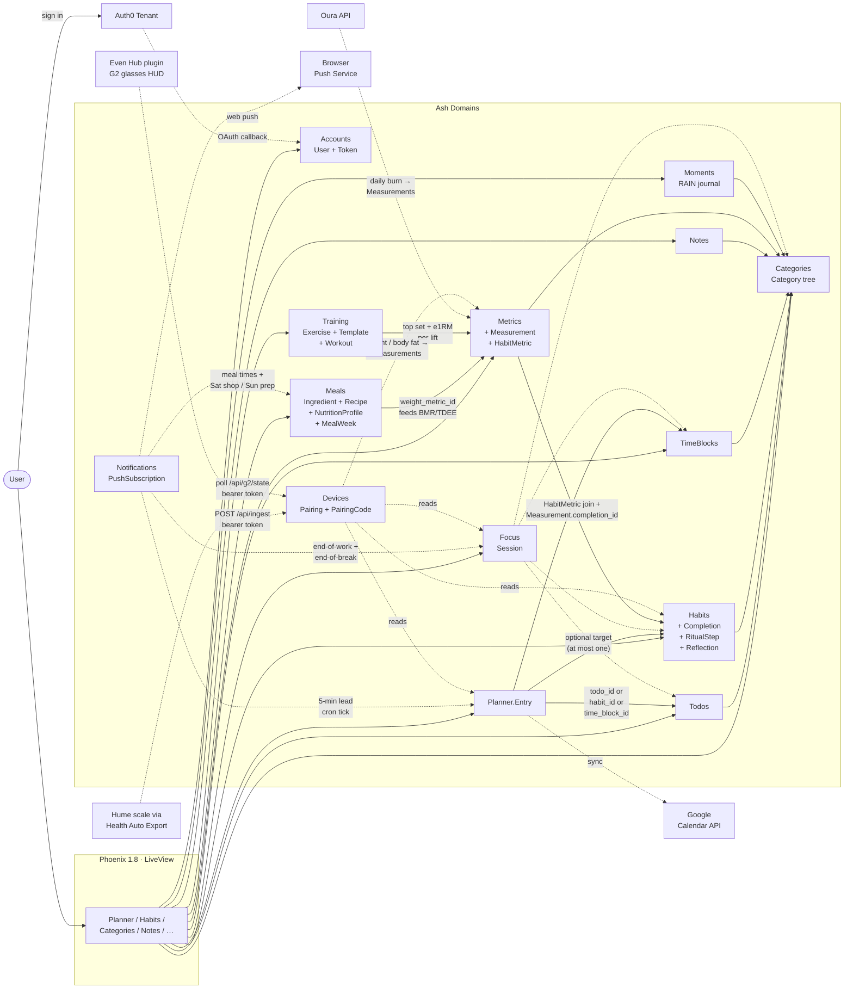

# Trellis

A weekly planning practice organised around **balance across life
areas**, not throughput. The north-star use case is a Sunday planning
ritual: look at the week behind, place habits and todos onto the week
ahead, sync the result to Google Calendar, then live the plan.

## Why "Trellis"?

A trellis is the wooden frame a vine grows up. It doesn't make the
plant grow — it just gives growth somewhere to attach. The categories
you keep, the habits you commit to, and the weekly ritual itself are
the trellis. Your life is what grows up through it: not faster, not
more, but with better support, in the directions you actually care
about. The app is the trellis; you are the gardener.

Phoenix 1.8 + LiveView + [Ash], Postgres + AshPostgres, Tailwind v4.
Single Phoenix app — no umbrella. Deployed as half of the
[benkolera-poncho] bundle alongside [pack-heavy].

[Ash]: https://ash-hq.org
[benkolera-poncho]: https://github.com/benkolera/benkolera-poncho
[pack-heavy]: https://github.com/benkolera/pack-heavy

## What it does

- **Categories** — a strict tree (no tags) of life areas: Health,
  Work, Relationships, Hobbies, etc. Each category gets a colour
  from Google's 11-colour calendar palette; children inherit unless
  they override. The tree surfaces neglect (how much time has rolled
  past without each area being touched).
- **Todos** — one-off intents pinned to a category, optionally with
  a duration. Surface in the planner pool when their week comes around.
  Todos can also be **recurring** (`weekly`/`every 2 weeks`/`monthly`);
  set a "first instance" anchor and the planner auto-primes an entry
  each cycle.
- **Habits** — recurring count-based intents ("3× per week"). Track
  completions per period; the streak heatmap + "don't miss twice"
  badge surface chains at risk. Each habit can carry an *identity
  statement* (Atomic Habits ch. 2) and a *two-minute fallback*
  (ch. 13). Habits can have ordered ritual steps (e.g. a morning
  routine) whose checks are tracked per completion.
- **Time blocks** — distinct from habits: tracked time slots (Sleep,
  Work) with weekly targets (`at_least 56h`, `at_most 50h`).
  Auto-placed onto the planner from availability windows. Lives in
  its own Ash domain so habit features (streaks, identity) don't
  conflict.
- **Notes** — composed from an ordered list of typed blocks.
  Markdown for prose; sketch blocks open a fullscreen Excalidraw
  canvas (Apple Pencil-friendly) and store a still preview back
  in the note; image blocks embed downscaled photos inline. New
  block kinds drop in with one enum value.
- **Planner** — weekly calendar (Schedule-X), drag-and-drop scheduling
  of todos/habits from a floating pool onto a time grid. Auto-primed
  with time-block availability each week. Per-category planned-time
  tree shows where the week's hours actually go.
- **Weekly review** — Atomic Habits ch. 20. Per-habit reflection
  with a 1-5 Goldilocks difficulty rating and freeform notes.
- **Metrics** — Beeminder-style numeric series. Each metric has a
  unit and an aggregation (point-in-time or summed per period);
  related metrics share a `group_name` so they cluster on one chart
  (Deadlift 1RM/3RM/8RM). Measurements can be entered manually
  (with backfill) or captured at habit completion — attach metrics
  to a habit, complete it, and a prompt asks for each value before
  the completion finalises. Each metric can carry a flat
  "yellow brick road" goal (`at_least` / `at_most` × a value per
  day/week/month); the chart overlays the road line and an on-track /
  off-track pill shows the current bucket's standing.
- **Meals** — macro-driven weekly meal planning around a Saturday
  shop and Sunday prep. An ingredient library (per-100g macros,
  seeded from the Australian Food Composition Database's 1,588 foods
  + custom packet-label entries) feeds recipes whose per-serving
  macros are calculated for free. A nutrition profile computes daily
  calorie/macro targets (Mifflin-St Jeor BMR → TDEE → cut/bulk rate,
  protein by g/kg) from the latest reading of your weight metric,
  with per-field manual overrides. The weekly plan auto-generates on
  the cookbook model — 2 breakfasts, 2 mains alternating across
  lunch/dinner, a daily snack, protein shakes topping up shortfalls —
  scales servings to hit the targets, and is reviewed (swap /
  reservings / regenerate) then confirmed. Confirming builds a
  checkable shopping list with per-ingredient gram totals for the
  Saturday shop. A dedicated scheduler (`Meals.Scheduler`) pushes
  meal-time reminders ("Lunch — Chicken rice · 1.5 servings"),
  a Saturday shopping-day reminder (or a nudge to generate the plan),
  and a Sunday prep reminder listing the week's dishes — all at
  user-local times from the nutrition profile. A progress panel on
  the plan page tracks user-chosen feedback metrics (weight, waist,
  body fat, lifts) with week-over-week deltas, closing the loop on
  whether the plan is working.
- **Moments** — radical-acceptance pauses (Tara Brach's RAIN: Recognize,
  Allow, Investigate, Nurture). When a craving, urge or feeling pulls,
  open the floating "Pause" button, name what's there, slide an intensity,
  and optionally journal through the four RAIN prompts. Designed to be
  mobile-quick — minimum required is the name and intensity. History
  page lists past moments filtered by kind.
- **Focus** — pomodoro-style sessions, server-backed so all your
  open clients (desktop + phone) stay in sync. A floating "Focus"
  pill on every page opens a start dialog with optional targeting:
  attach to a todo, habit, time block, or category — or run
  freestanding. End-of-work and end-of-break fire push
  notifications. Planner entries get an inline "Focus" button that
  prefills the target. History page at `/focus` groups completed
  sessions by day with a today tally.
- **Google Calendar push** — one-way sync from the planner to the
  user's primary calendar. Idempotent via stored `google_event_id`;
  category colour drives the event colour.
- **Even Hub (G2 glasses)** — a separate Even Hub plugin pulls Trellis
  state onto Even Realities G2 smart glasses: now / next planner entry,
  live focus countdown, today's habit nudges, and (server-side ready)
  the in-gym strength card — current exercise, set x of y, target reps
  @ weight, rest countdown. (Rendering the strength card needs a
  plugin-repo update.) Pairing is a 6-char
  code generated in Settings, then redeemed by the plugin for a
  long-lived bearer token (stored as a SHA-256 hash). State is served by
  a small JSON API at `/api/g2/*`; the plugin polls every 10–30 s.
- **Training** — a linear A/B strength programme (StrongLifts-style)
  over your exercise pool: barbell lifts add weight each successful
  session (auto-deload ~10% after 3 stalls), kettlebell/bodyweight
  accessories rotate through session slots progressing by reps.
  `/training` shows the week and the next prescribed session;
  `/training/session` is the phone-first in-gym screen — tap a set to
  log it at target reps, step down for misses, rest countdown between
  sets. Finishing applies progression and auto-logs each lift's top
  set + Epley e1RM into Metrics (charting alongside everything else);
  abandoning applies nothing. Templates, days, and per-exercise
  parameters are all editable in settings.
- **Oura ring** — per-user OAuth pulls daily calorie burn into
  Metrics ("Oura active/total kcal") every morning, and upgrades the
  meal plan's TDEE from the activity-multiplier formula to the
  measured 14-day average once a week of data exists.
- **Measurement ingest webhook** — `POST /api/ingest/measurements`
  with a per-user bearer token (the Devices pairing model, `:ingest`
  kind) writes weight / body-fat readings onto the profile-mapped
  metrics. Accepts a generic JSON shape and the Health Auto Export
  format, which is the relay path for the Hume Body Pod scale
  (Hume → Apple Health → scheduled POST). Idempotent per reading.
- **Web push notifications** — opt-in per browser. The Settings page
  has Enable / Send test / per-device disable. A cron-driven
  scheduler (`Notifications.Scheduler`) fires a push 5 min before
  each planner entry's start. VAPID keys configured via
  `VAPID_PUBLIC_KEY` / `VAPID_PRIVATE_KEY` env vars in prod;
  `mix generate.vapid.keys` to mint a pair.

## Architecture



Every plannable thing — todo, habit, time block — points back at a
category, which is the unit of "this is a part of my life". The
planner just maps `(category, intent) → time on the calendar`. The
neglect score rolls up the category tree to highlight areas you've
underweighted.

**Stack notes:**

- **Ash, not raw Ecto** — Resources, actions, policies. Migrations
  generated via `mix ash.codegen`. The exception is one-shot data
  moves (e.g. splitting time blocks out of habits) which are
  manual Ecto migrations.
- **Schedule-X** for the planner calendar — wired in via a LiveView
  `phx-hook` with `phx-update="ignore"`; drag/click events round-trip
  through `pushEvent`. Calendar configs registered for all 11
  Google colours so events styled with `calendarId` pick up the
  right hex.
- **Auth0** for sign-in in prod; password strategy in dev/test via
  a `Mix.env() in [:dev, :test]` guard on the `password` block.
- **No daisyUI** — hand-rolled Tailwind components, per the
  `AGENTS.md` convention.

## Running locally

```bash
mix setup            # deps.get, ash.setup, assets.setup + build, seeds
mix phx.server       # http://localhost:4000
```

The dev environment uses the `password` auth strategy (Auth0 is only
compiled in for prod). A default user gets seeded; check
`priv/repo/seeds.exs`.

Prod runtime expects these environment variables (set by the poncho
bundle's `runtime.exs` when deployed):

- `DATABASE_URL`, `SECRET_KEY_BASE`, `TOKEN_SIGNING_SECRET`
- `AUTH0_DOMAIN`, `AUTH0_CLIENT_ID`, `AUTH0_CLIENT_SECRET`
- Optional: `GOOGLE_CLIENT_ID`, `GOOGLE_CLIENT_SECRET` (calendar push)

## Tests

```bash
mix test
```

Tests use real Postgres (no mocking — `ash.setup --quiet` runs first,
configured via the `test:` alias in `mix.exs`).

## Deployment

This app is deployed as part of [benkolera-poncho] — a separate repo
that bundles electric-brain + pack-heavy into one Fargate task on
shared AWS infrastructure. See the poncho's README for the runtime
architecture and release flow.

For day-to-day work: commit + push here, then run `release.sh` in
the poncho repo to bump the submodule pointer and ship.
